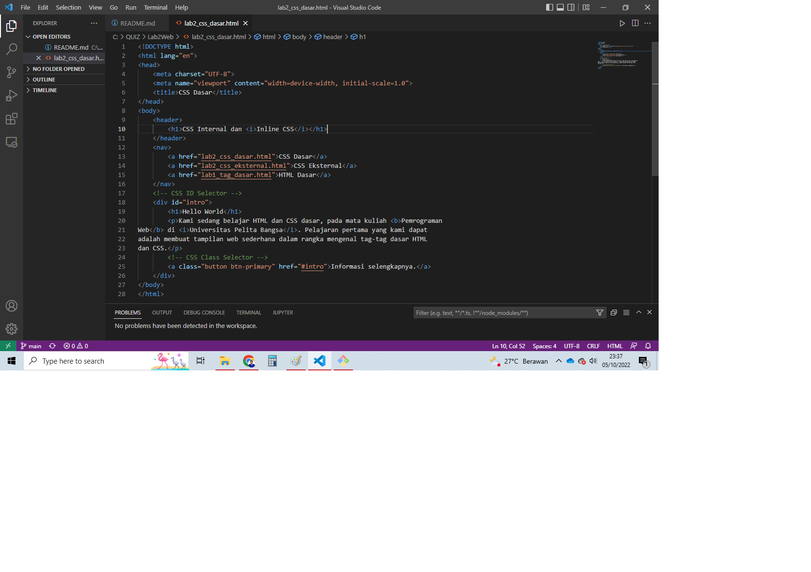
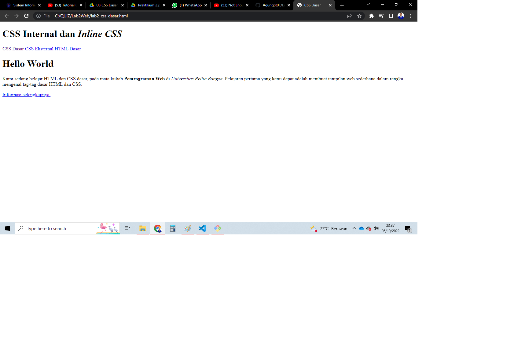
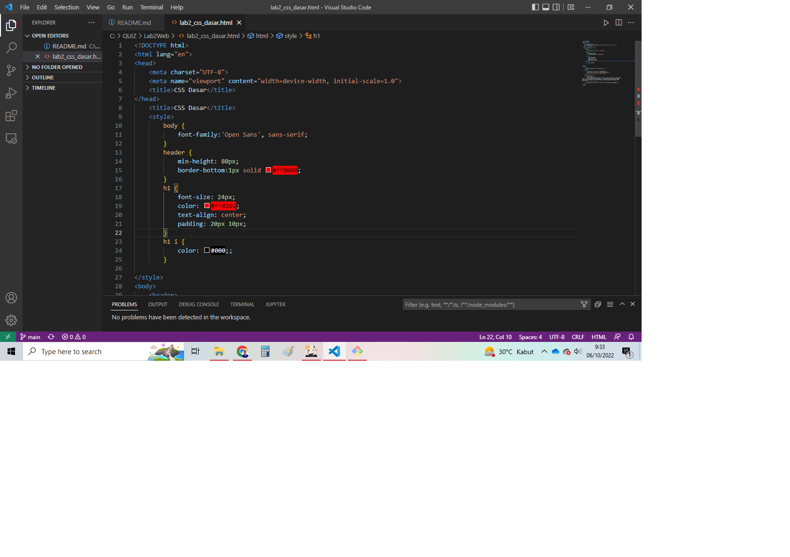
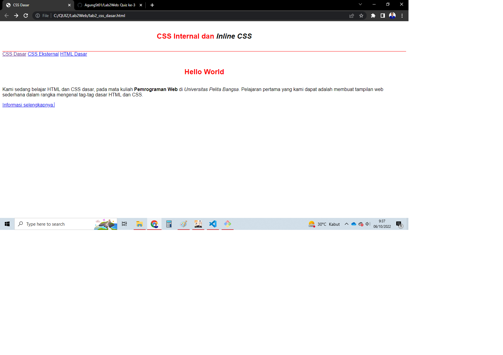
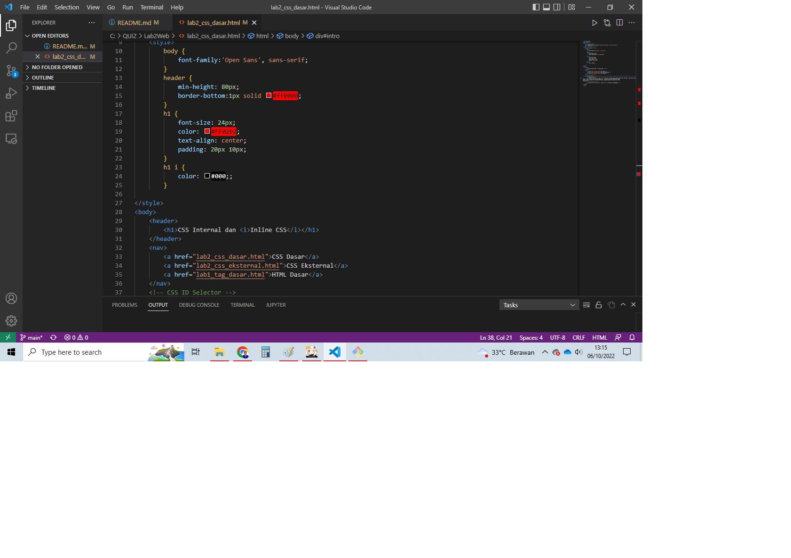
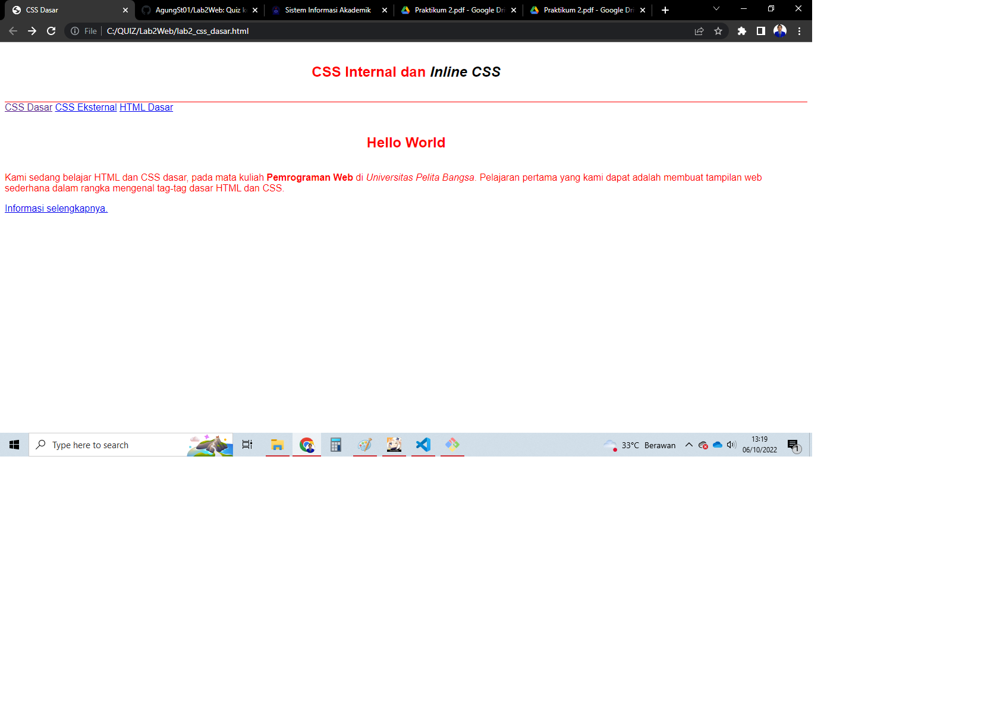
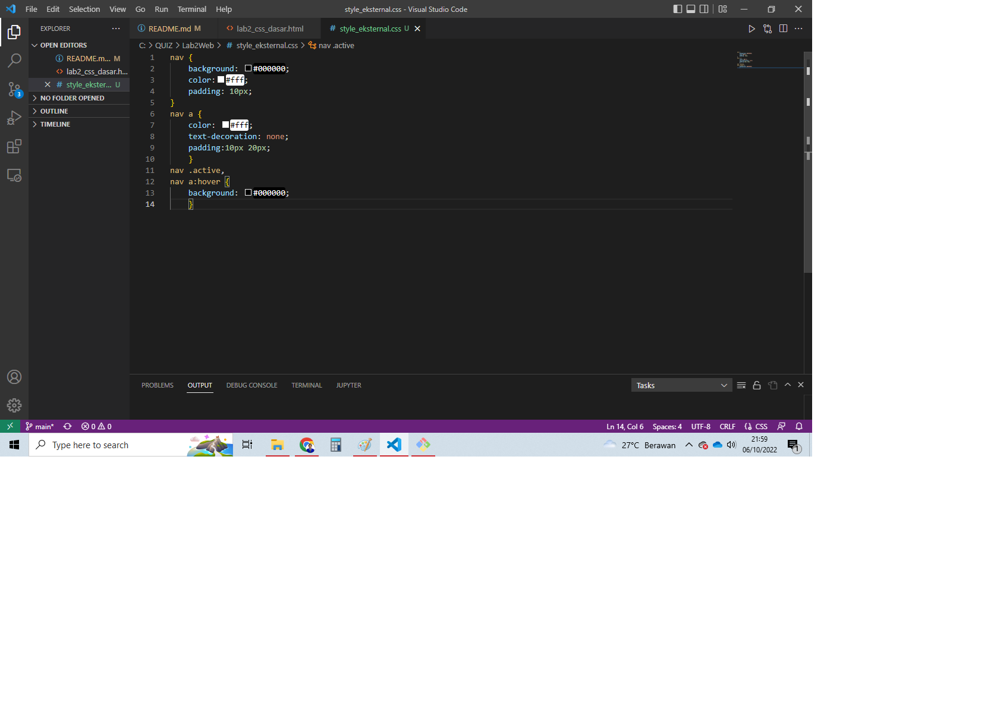
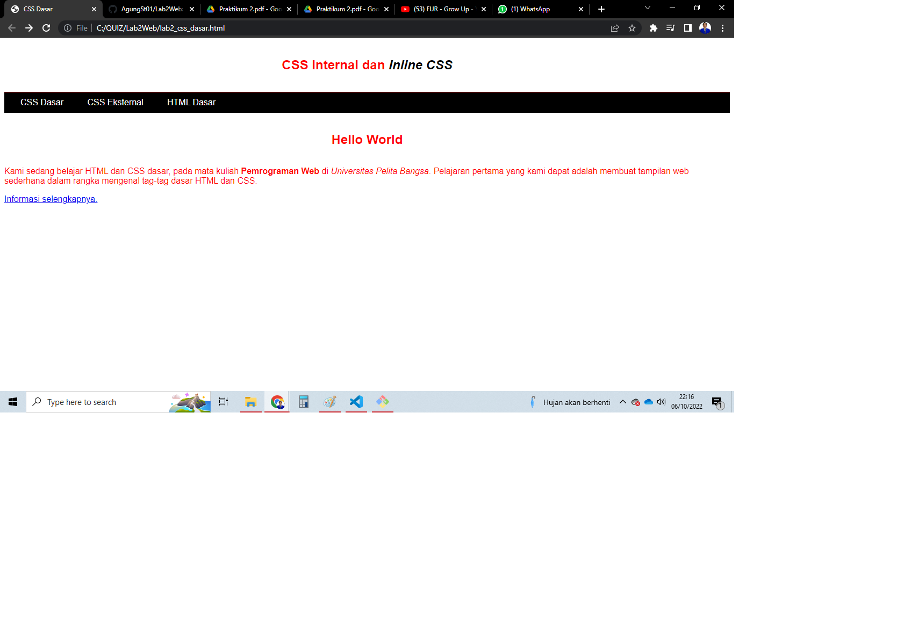
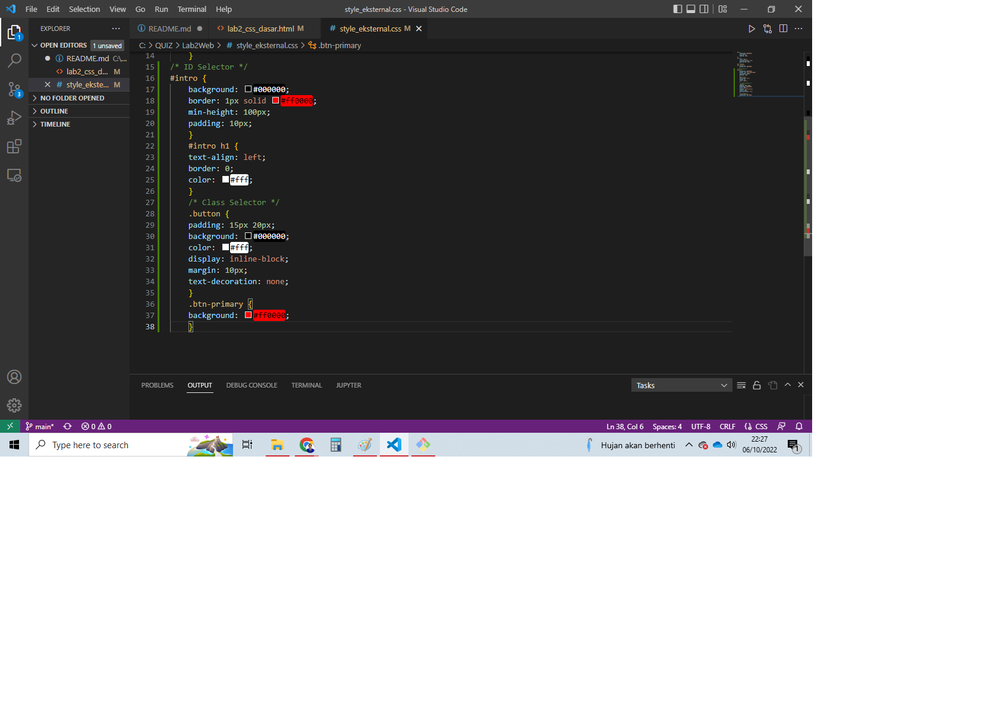
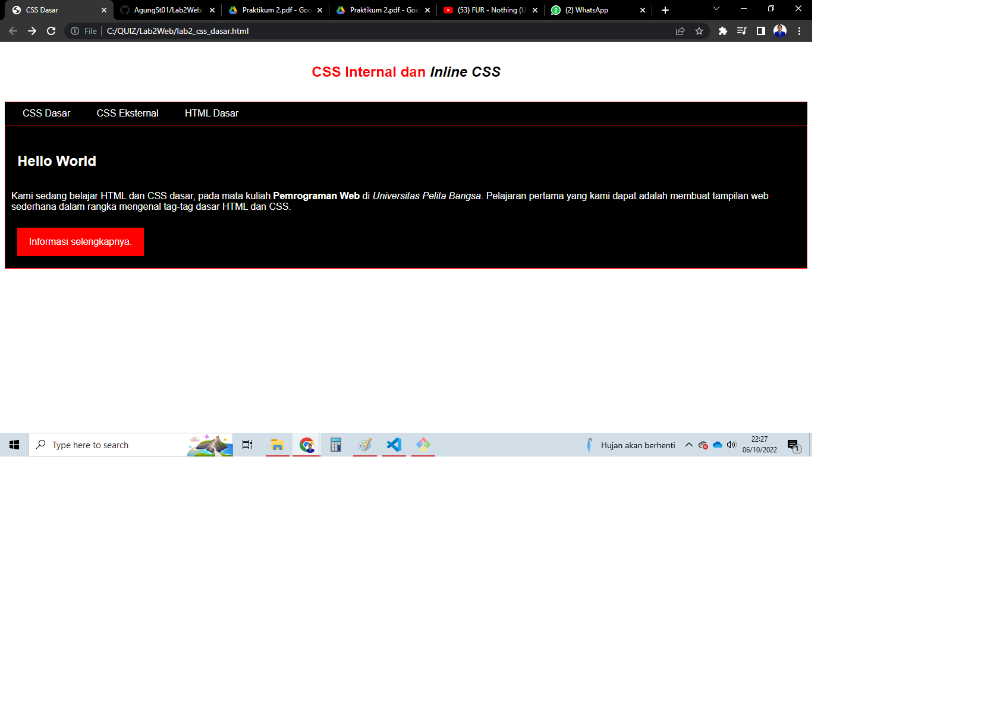

# Lab2Web
Quiz ke-3

### Membuat Dokumen HTML
Ditugas sebelumnya kita telah Membuat dokumen HTML yang berisi judul yang menggunakan tag `<title>`, lalu ada perintah membuat paragraf menggunakan tag `
`, lalu ada perintah membuat hyperlink menggunakan tag `<a>`lalu ada perintah membuat href yang bertujuan masuk ke URL yang akan dituju oleh pengguna. Berikut syntax atau command nya :

Dan ini contoh hasilnya :

### Mendeklarasikan CSS Internal
Lalu pada intruksi selanjutnya yaitu Mendeklarasikan CSS internal, yang diletakan pada bagian head dokumen, penulisan internal CSS menggunakan tag `<style>` yang diletakkan pada `<head>` dokumen. Berikut syntax atau command nya :

Dan ini contoh hasilnya :

### Menambahkan Inline CSS
Pada Praktikum selanjutnya Kita tambahkan deklarasi inline CSS pada tag `
` dengan command `
` command tersebeut akan mengubah warna huruf pada paragraf. Berikut syntax atau command nya :

Dan ini hasilnya :

### Membuat CSS eksternal
Selanjutnya kita akan membuat CSS eksternal dengan cara buatlah file baru dengan nama `style_eksternal.css` kemudian buatlah deklarasi CSS seperti berikut syntax atau command nya :

Setelah membuat dan menyimpan file css tersebut, kemudian kita tambahkan tag `<link>` pada file lab2_css_dasar.html pada bagian `<head>` untuk menyambungkan file CSS yang telah dibuat. Dan ini adalah hasilnya:

### Menambahkan CSS selector
Lalu Selanjutnya menambahkan CSS Selector menggunakan `ID dan Class Selector`. Pada file
style_eksternal.css, tambahkan kode berikut :

Dan ini Hasilnya:

